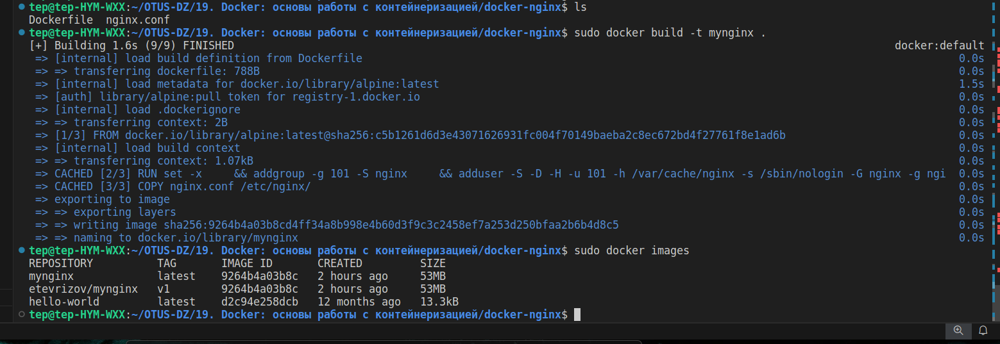
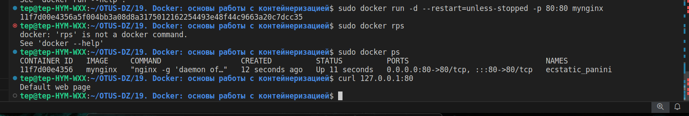

# Docker
Цель домашнего задания
Разобраться с основами docker, с образом, эко системой docker в целом;


### 1.Создать свой кастомный образ nginx на базе alpine. 
После запуска nginx должен отдавать кастомную страницу (достаточно изменить дефолтную страницу nginx).

__Сборка образа__  

  


__Запуск контейнера__  

  


### 2.Определить разницу между контейнером и образом.


__Контейнер__  
При запуске контейнерной среды внутри контейнера создается копия файловой системы (docker образа) для чтения и записи.
Контейнер Docker (Docker Container) - это виртуализированная среда выполнения, в которой пользователи могут изолировать 
приложения от хостовой системы. Эти контейнеры представляют собой компактные портативные хосты, в которых можно быстро 
и легко запустить приложение.
Контейнеры работают автономно, изолированно от основной системы и других контейнеров, и потому ошибка в одном из них 
не влияет на другие работающие контейнеры, а также поддерживающий их сервер.  
Один `Docker`-контейнер = 1 сервис, сами контейнеры создаются из образов `image`. Так же можно внести изменения в работающем контенере, потом закоммитить его и получить новый образ.
```php
docker commit 1e6229dd21rd nginxnew:v1.2
```


__Образ__     
Образ Docker (Docker Image) - это неизменяемый файл, содержащий исходный код, библиотеки, зависимости,
инструменты и другие файлы, необходимые для запуска приложения.
Образы предназначены только для чтения их иногда называют снимками (snapshot).
Они представляют приложение и его виртуальную среду в определенный момент времени.  
Так как образы являются просто шаблонами, их нельзя создавать или запускать. 
Этот шаблон можно использовать в качестве основы для построения контейнера.
Образ - это шаблон, на основе которого создается контейнер, существует отдельно и не может быть изменен.  
Образ собирается из:  
  1) слоев, каждый слой собирается из своей директивы в Dockerfile'е, где директивы ENV и ARG не являются слоями и
  2) начального образа, болванки, из директивы FROM в Dockerfile'е. 

Таким образом, образы могут состоять из ряда слоев, каждый из которых отличается от предыдущего.
Слои образа представляют файлы, доступные только для чтения, поверх которых при создании контейнера добавляется новый слой.

Можно создать/запустить неограниченное количество контейнеров из одного образа.
    


__Отличие от виртуализации__  
В отличие от виртуальных машин, где виртуализация выполняется на аппаратном уровне,
контейнеры виртуализируются на уровне приложений. Они могут использовать одну машину, 
совместно использовать ее ядро и виртуализировать операционную систему для выполнения 
изолированных процессов. Это делает контейнеры чрезвычайно легкими, позволяя сохранять ценные ресурсы.


### 3. Можно ли в контейнере собрать ядро?


### 4.Собранный образ запушить в docker hub.

tep@tep-HYM-WXX:~/OTUS-DZ/19. Docker: основы работы с контейнеризацией/docker-nginx$ sudo docker tag mynginx etevrizov/mynginx:v1
tep@tep-HYM-WXX:~/OTUS-DZ/19. Docker: основы работы с контейнеризацией/docker-nginx$ sudo docker images
REPOSITORY          TAG       IMAGE ID       CREATED          SIZE
etevrizov/mynginx   v1        9264b4a03b8c   36 minutes ago   53MB
mynginx             latest    9264b4a03b8c   36 minutes ago   53MB
hello-world         latest    d2c94e258dcb   12 months ago    13.3kB
tep@tep-HYM-WXX:~/OTUS-DZ/19. Docker: основы работы с контейнеризацией/docker-nginx$


tep@tep-HYM-WXX:~/OTUS-DZ/19. Docker: основы работы с контейнеризацией/docker-nginx$ sudo docker push etevrizov/mynginx:v1
The push refers to repository [docker.io/etevrizov/mynginx]
e2535bd89b95: Pushed 
091f2e931cf5: Pushed 
d4fc045c9e3a: Mounted from library/alpine 
v1: digest: sha256:96f88234c3db0a69fc6f9b1606540a1e4a67da12747b994d78e627d35ec8ee31 size: 947
tep@tep-HYM-WXX:~/OTUS-DZ/19. Docker: основы работы с контейнеризацией/docker-nginx$ 


Задание со звездочкой

1.Написать Docker-compose для приложения Redmine, с использованием опции build.
2.Добавить в базовый образ redmine любую кастомную тему оформления.
3.Убедиться что после сборки новая тема доступна в настройках.
4.Настроить вольюмы, для сохранения всей необходимой информации